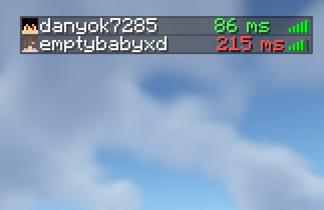

# PingDisplay

[](https://github.com/emptyenemy/ping_display/actions/workflows/build.yml)
[](LICENSE)
[](https://papermc.io/)

Лёгкий плагин для Paper/Spigot, который показывает пинг каждого игрока прямо в таб-листе (список игроков по клавише <kbd>Tab</kbd>). Значение подсвечивается цветом в зависимости от качества соединения.

*[English version](README.en.md)*

## Как выглядит



Цвета:

| Пинг | Цвет |
|------|------|
| < 100 ms | 🟢 зелёный |
| 100–199 ms | 🟡 жёлтый |
| ≥ 200 ms | 🔴 красный |

## Требования

- **Minecraft:** 1.21.x
- **Сервер:** Paper (или Spigot/Bukkit-совместимый форк)
- **Java:** 21+

## Установка

1. Скачайте `PingDisplay-1.0.1.jar` со [страницы релизов](https://github.com/emptyenemy/ping_display/releases).
2. Положите файл в папку `plugins/` вашего сервера.
3. Перезапустите сервер.

При первом запуске плагин создаст `plugins/PingDisplay/config.yml` со значениями по умолчанию.

## Настройка

`plugins/PingDisplay/config.yml`:

```yaml
# Частота обновления пинга в тиках (20 тиков = 1 секунда)
ping-update-interval: 20
```

| Параметр | Тип | По умолчанию | Описание |
|----------|-----|--------------|----------|
| `ping-update-interval` | int | `20` | Интервал обновления таб-листа в игровых тиках. Меньшее значение — более частое обновление и чуть выше нагрузка. |

Изменения применяются после перезапуска сервера.

## Сборка из исходников

Нужны JDK 21+ и Maven 3.9+:

```bash
git clone https://github.com/emptyenemy/ping_display.git
cd ping_display
mvn clean package
```

Готовый jar появится в `target/PingDisplay-1.0.1.jar`.

## Планы

Плагин намеренно минимален по функциональности. В ближайших планах:

- поддержка актуальных версий Minecraft;
- перезагрузка конфига командой, без рестарта сервера;
- настраиваемые пороги и цвета через конфиг;
- настраиваемый формат строки вместо жёстко зашитого;
- совместимость с плагинами, которые тоже меняют таб-лист.

## Лицензия

[MIT](LICENSE) © emptyenemy
